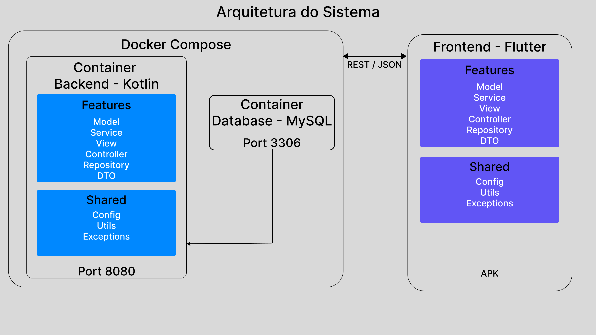

# Documentação do Projeto

## Visão Geral da Arquitetura

## Qualidade de Código

### Configuração SonarCloud

O projeto está integrado ao SonarCloud via GitHub App. As configurações abaixo estão definidas no painel do SonarCloud e refletem a arquitetura feature-based.

#### Regras de nomenclatura

| Artefato | Sufixo obrigatório | Exemplo |
|---|---|---|
| Controlador REST | `Controller` | `CachorroController.kt` |
| Lógica de negócio | `Service` | `CachorroService.kt` |
| Acesso a dados | `Repository` | `CachorroRepository.kt` |
| Entidade JPA | `Entity` | `CachorroEntity.kt` |
| Objeto de transferência | `DTO` ou `Dto` | `CachorroDTO.kt` |
| Payload de entrada | `Request` | `CachorroRequest.kt` |
| Payload de saída | `Response` | `CachorroResponse.kt` |
| Mapeamento | `Mapper` | `CachorroMapper.kt` |
| Exceção customizada | `Exception` | `CachorroNotFoundException.kt` |

> Manter essa nomenclatura é obrigatório. O SonarCloud usa os sufixos para aplicar as regras de cobertura corretamente.
